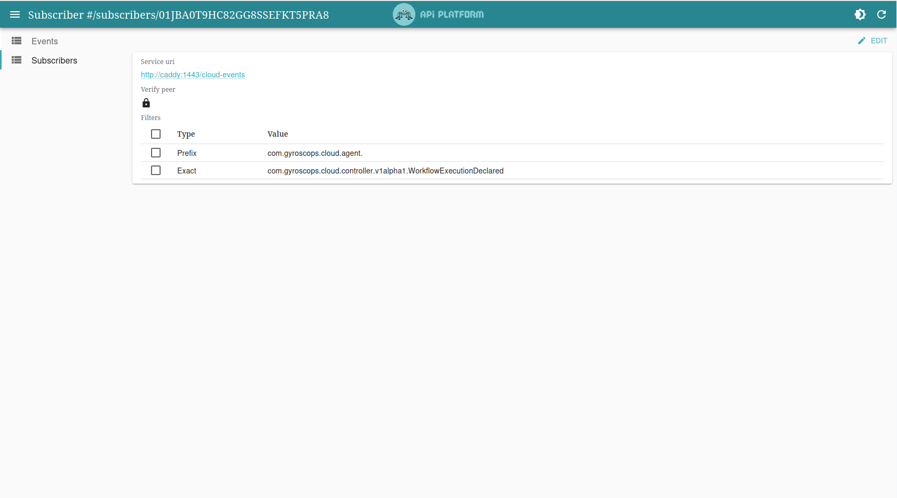

Cloud Events Web UI
===

A web interface for your Cloud Events infrastructure.
This application stores all events making you able to see what data is sent between your microservices.


Additionally, you can redispatch events to your other services, making this app act like a __simplified__ Knative Broker resource.



This application is meant for development/debugging purposes on local development environment.
It lacks a lot of security features to be deployed in production environments.
Use at your own risk. 

## Install with Docker Compose

1. clone the repository
    ```shell
    git clone https://github.com/gplanchat/cloud-events-webui.git
    ```
2. start the stack
    ```shell
    docker compose up -d
    ```

## Install with Helm in a Kubernetes cluster

1. clone the repository
    ```shell
    git clone https://github.com/gplanchat/cloud-events-webui.git
    ```
2. deploy in your Kubernetes cluster
    ```shell
    helm dependencies update ./helm/cloudevents-webui
    helm lint ./helm/cloudevents-webui
    helm upgrade main ./helm/cloudevents-webui --namespace=default --create-namespace --wait \
    --install \
    --set "php.image.repository=gcr.io/test-cloudevents-webui/php" \
    --set php.image.tag=latest \
    --set "pwa.image.repository=gcr.io/test-cloudevents-webui/pwa" \
    --set pwa.image.tag=latest \
    --set php.appSecret='!ChangeMe!' \
    --set postgresql.postgresqlPassword='!ChangeMe!' \
    --set postgresql.persistence.enabled=true \
    --set "corsAllowOrigin=^https?:\/\/[a-z]*\.mywebsite.com$"
    ```

For more details, check the [API Platform official documentation](https://api-platform.com/docs/deployment/kubernetes/)

## Install with Skaffold in a Kubernetes cluster

1. clone the repository
    ```shell
    git clone https://github.com/gplanchat/cloud-events-webui.git
    ```
2. start the stack in your Kubernetes cluster
    ```shell
    cd helm/
    skaffold dev
    ```

For more details, check the [API Platform official documentation](https://api-platform.com/docs/deployment/minikube/)
